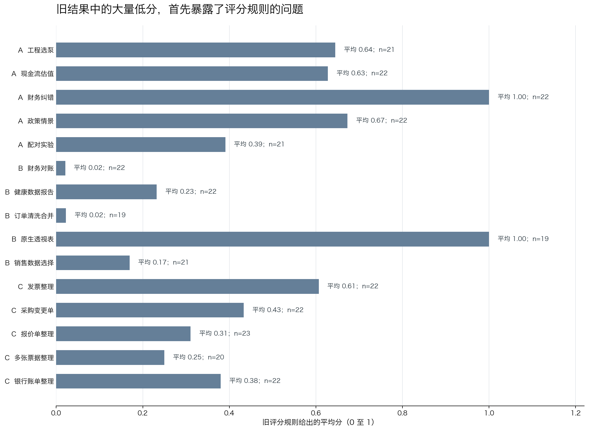
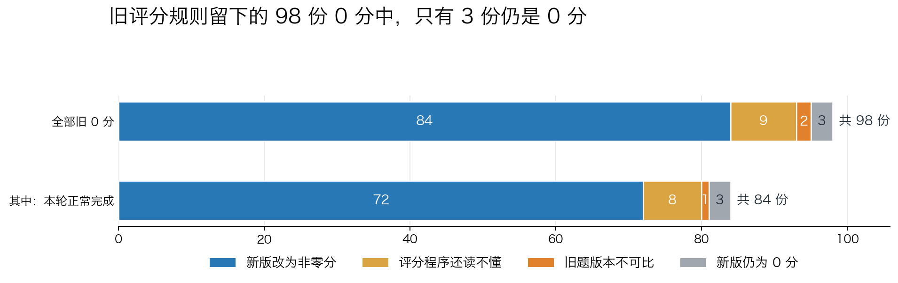
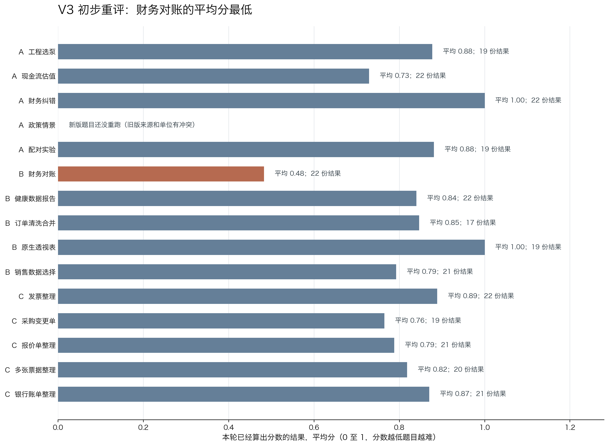
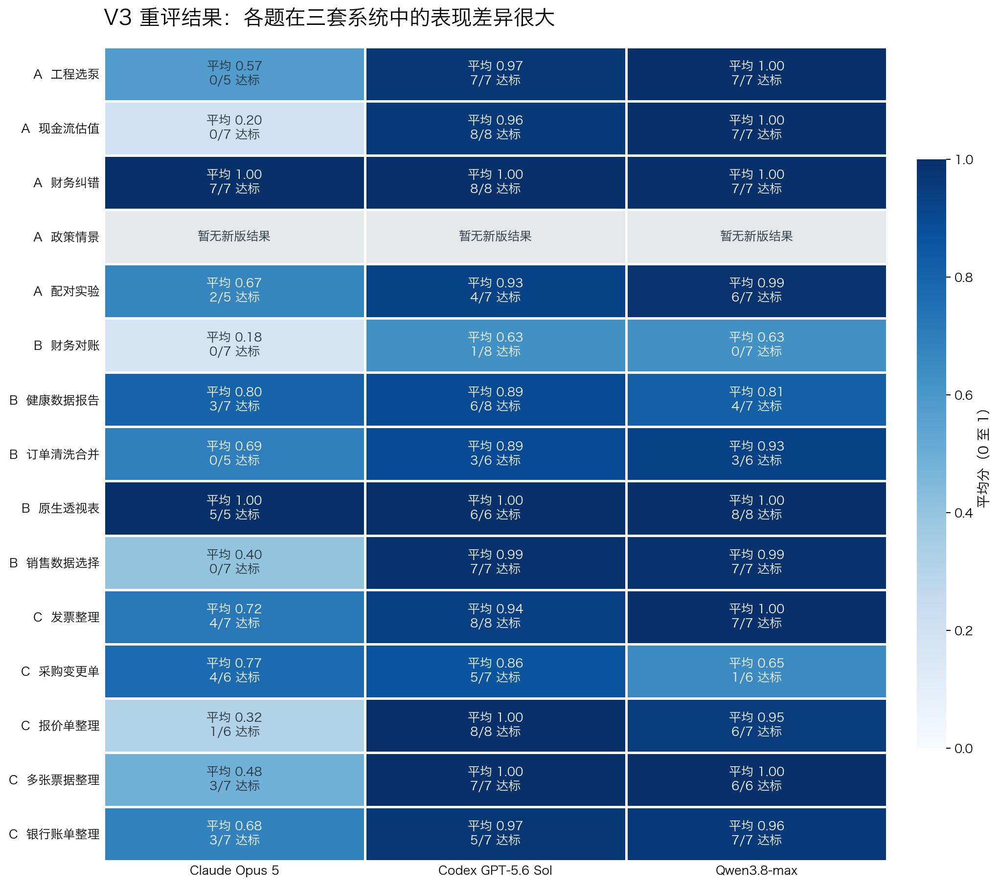

# P15 评分规则重审与初步结果

## 一、上周搭好了 15 道题，本周开始检验评分规则

上周完成了 P15 的 15 道开发校准题，并为 3 套 Agent 系统安排了每题 8 次独立运行。初版汇报主要介绍任务怎么设计、运行到了哪里，以及当时的初步分数。

这周新增了两部分证据。截至目前，计划中的 360 次运行已经完成 351 次；同时，我们用新版评分规则重新检查了现有的 368 份 Excel 结果。重评后的变化很大，说明这批数据首先揭示的是评分标准的问题，还不能直接用来给模型排名。

15 道题覆盖三类 Excel 工作：

| 类型 | 题目要完成的工作 | 主要检查什么 |
|---|---|---|
| A | 建模、计算、调试和情景修改 | 公式、单位、跨表关系、输入变化后结果是否跟着变化 |
| B | 找数据、清洗、合并、对账和透视分析 | 数据选得对不对、异常有没有保留、结果能不能闭合 |
| C | 把 PDF、图片和多页文档整理成 Excel | 文档结构、跨页关系、来源页码、金额勾稽和可追溯性 |

其中 5 道题参考了公开方法或数据：工程选泵参考 NIST 的 SI 单位规则；现金流估值使用 SEC Apple Company Facts 的项目内摘录；政策情景参考 EIA 公开发电数据；配对实验使用 R 的 `sleep` 数据集；健康数据报告使用 CDC/NCHS 数据摘录。其余 10 道题的业务场景和材料由项目构造。

任务设计另外参考了 BlueFin、WTM-Bench、SpreadsheetBench 2、FINCH、DataGovBench、FinBalance、DocILE、ReceiptBench、VAREX 和变形测试综述。具体论文、公开数据和每道题的来源写在 [来源目录](../../references/SOURCE_CATALOG.md)。

## 二、初版评分逻辑合理，但落到真实结果上过于依赖版式

初版评分规则的思路是把每道题拆成若干项，分别检查数值、公式、记录完整性、来源保留和对账结果，再按权重合成 0 至 1 分。一份结果要“达标”，总分至少为 0.70，而且对账闭合、来源选择等关键要求必须通过。

最初的设计分成四层：

| 设计层 | 初版做法 | 原本想解决的问题 |
|---|---|---|
| 评分对象 | 每道题拆成 8 至 15 个评分项 | 避免只看最终一个数字，保留过程和交付质量 |
| 分数 | 各项按重要程度加权，总分为 0 至 1 | 区分完全完成、部分完成和几乎未完成 |
| 达标条件 | 总分至少 0.70，并通过少量关键要求 | 防止格式分数掩盖对账不平、数据选错等业务错误 |
| 测试文件 | 标准答案、空白文件、损坏文件和人工加入的错误 | 确认评分程序能接受正确答案，也能拒绝明显错误 |

这个框架本身可以保留。问题出在具体检查方式。初版评分程序经常按照参考答案的表名、起始行、固定列和特定文字找结果。Agent 只要换一种合理布局，评分程序就可能找不到答案。

初版还把几种完全不同的情况混在了一起：

| 情况 | 应该怎样处理 |
|---|---|
| 业务结果确实错误 | 按评分项扣分 |
| 文件存在，但评分程序读不懂 | 暂时不打分，先修评分程序 |
| 题面或数据版本本身有问题 | 整批结果不进入比较 |
| 原生透视表还没有在 Excel 中刷新确认 | 等 Excel 重算后再判断 |
| 运行环境中断 | 不算 Agent 的业务失败 |

## 三、大量低分首先暴露了评分标准的问题

旧结果中，财务对账、订单清洗、报价单和多张票据几乎全部未达标。如果直接照这个分数解释，就会得到“多套系统在多道题上完全不会做”的结论。真实文件检查并不支持这个说法。

逐题检查后，问题主要集中在四类：

1. **把版式当成答案。** 固定表名、列位置或页码写法会误拒业务结果正确的替代布局。
2. **加入题面没有说的要求。** 例如强求每一行都必须使用某种公式，或者要求特定的刷新属性。
3. **同一个错误被重复扣分。** 一个上游输入错误会自然带错多个下游数字，旧规则有时把这些连锁结果分别处罚。
4. **评分程序失败被写成 0 分。** 程序找不到答案，不等于 Agent 没有完成答案。

以下几道题最能说明问题：

| 题目 | 旧结果 | 为什么旧结果不能直接解释 |
|---|---:|---|
| 配对实验 | 2/21 达标，平均 0.39 | 旧规则依赖固定工作表结构，又没有把受试者编号与统计结论完整对应起来 |
| 财务对账 | 0/22 达标，平均 0.02 | 关账期、重复归类和差异桥的检查不完整，合理布局也可能被漏掉 |
| 订单清洗合并 | 0/19 达标，平均 0.02 | 查找范围过小，额外列和额外异常容易漏检，不同表格还可能拼分 |
| 报价单整理 | 0/23 达标，平均 0.31 | 一个字段的含义曾被反向理解，识别方式也过度依赖参考版式 |
| 多张票据整理 | 0/20 达标，平均 0.25 | 评分程序自己重新算了对账结果，却没有检查答卷真正展示的结果 |
| 银行账单整理 | 1/22 达标，平均 0.38 | 页码要求过严，期初余额被不必要地要求写成公式，分类汇总检查反而偏松 |

98 份结果在旧规则下被记成 0 分。换用新版规则后，84 份变成非零，9 份暂时算不出分，2 份属于旧题版本，只有 3 份仍是 0 分。Agent 没有重新做题，变化完全来自评分规则。

## 四、新版评分从“对答案”改成“看业务结果”

新版评分规则（V3）保留“分项评分、加权总分、关键要求”这个框架，重新定义了每一层到底判断什么。

| 评分环节 | 初版逻辑 | V3 逻辑 | 当前完成情况 |
|---|---|---|---|
| 找到答案 | 按固定表名、行列和文字查找 | 根据表头、业务编号、标签和数值关系找到一块完整的交付区域 | 已完成主体修改，复杂布局仍要补测 |
| 判断正确 | 与参考文件中的固定数值或公式比较 | 检查业务事实、金额关系和专业上应当始终成立的关系，接受等价公式 | 已完成主体修改 |
| 检查联动 | 主要检查单元格里有没有公式 | 改变题目输入，再看下游结果是否一起变化 | 已在明确要求联动的题目中加入 |
| 决定达标 | 主要看加权总分 | 总分达到 0.70 后，还必须通过会改变业务结论的关键要求 | 部分题已经加入，订单清洗和文档题仍需补全 |
| 处理异常 | 评分失败有时直接落成 0 分 | 分开记录业务错误、暂时算不出分、旧题版本和需要 Excel 重算 | 已完成 |
| 解释扣分 | 列出所有未通过的评分项 | 先找最早出现的实质错误，再说明它带来的后续影响 | 已确定原则，还没有在 15 道题中全部实现 |
| 固定版本 | 主要固定评分代码 | 题面、输入、评分项、评分程序和结果清单必须属于同一版本 | 已确定原则，本次清单还没有全部绑定 |

一份 Excel 结果进入 V3 后，目标流程是这样的：

1. 先确认它对应哪一版题面和输入文件。
2. 在文件里找到一块前后一致的交付区域，不能从互相矛盾的表格里拼分。
3. 核对业务数字、公式关系、记录完整性和来源信息。
4. 题目要求动态联动时，改变输入并重新计算。
5. 先记录最早的实质错误，再把后续错误写成影响，不重复扣分。
6. 能可靠判断时给出分数和达标结论；不能判断时说明缺少什么证据。

新版规则已经检查了 168 个测试文件，包括标准答案、等价答案、不同布局、空白答卷、损坏文件和故意加入的业务错误。这些测试证明程序按当前设定运行，还不能证明每条设定都合理。订单清洗、原生透视表和 5 道 C 类文档题仍有已知问题；工程选泵、健康数据报告和销售数据选择还要补充更多真实布局。

全部题面、评分文件、测试样例和本次结果已经整理到 GitHub：
[P15 Excel Agent Benchmark 评审仓库](https://github.com/alex051107/excel-multimodal-benchmark-p15-review)

## 五、V3 重评显示：14 道题的平均分在 0.48 至 1.00 之间

新版规则检查了全部 368 份现有 Excel 文件，其中 322 份算出了分数。另外 46 份没有分数：12 份评分程序暂时读不懂，24 份来自有来源和单位问题的旧版政策题，10 份还要用 Microsoft Excel 打开并重新计算。这 46 份没有被当成 0 分。

下面的逐题表只使用本轮正常完成、并且新版规则算出了分数的 286 份结果。历史额外运行和失败重试不进入平均分。

| 题目 | 有分数的结果 | 达标 | 平均分 | 目前怎样解释 |
|---|---:|---:|---:|---|
| A 工程选泵 | 19 | 14/19 | 0.88 | 新版分数明显高于旧版，还要补测标签和值相隔较远的布局 |
| A 现金流估值 | 22 | 15/22 | 0.73 | 结果处在中间位置，适合作为校准题 |
| A 财务纠错 | 22 | 22/22 | 1.00 | 旧版和新版都全部达标，可以作为简单对照题 |
| A 政策情景 | 暂无新版结果 | 无 | 无 | 现有文件来自有问题的旧题，不能写成 0.00，也不能继续评分 |
| A 配对实验 | 19 | 12/19 | 0.88 | 旧版低分主要来自布局和编号对应问题；仍有 2 份暂时算不出分 |
| B 财务对账 | 22 | 1/22 | 0.48 | 修正规则后仍明显偏低，需要逐份确认真实错误 |
| B 健康数据报告 | 22 | 13/22 | 0.84 | 整体并不低；同一张表放多个业务区块时仍可能误判 |
| B 订单清洗合并 | 17 | 6/17 | 0.85 | 平均分高、达标数低，说明总分和关键要求之间仍有冲突 |
| B 原生透视表 | 19 | 19/19 | 1.00 | 目前全部达标，还要确认数据连接和 Excel 刷新 |
| B 销售数据选择 | 21 | 14/21 | 0.79 | 新版纠正了大量旧低分，还要防止从矛盾表格中拼分 |
| C 发票整理 | 22 | 19/22 | 0.89 | 旧低分被大幅纠正；页码、金额联动和重复表格仍需补测 |
| C 采购变更单 | 19 | 10/19 | 0.76 | 不再强求固定布局，但公式要求和关键总额仍需核对 |
| C 报价单整理 | 21 | 15/21 | 0.79 | 修正字段含义后分数恢复，识别逻辑仍偏向一种布局 |
| C 多张票据整理 | 20 | 16/20 | 0.82 | 旧 0 分基本消失，还要改成检查答卷实际展示的对账结果 |
| C 银行账单整理 | 21 | 15/21 | 0.87 | 旧版的页码和公式要求过严，新版仍要补强分类汇总和对账检查 |

286 份结果的平均分是 0.825，其中 191 份达标，占 66.8%。

为了看清同一道题在三套系统中的差异，下面再把本轮正常完成、并且 V3 算出分数的结果按“题目 × 系统”展开。每个格子第一行是平均分，第二行是“达标数/有分数的结果数”。灰色格子表示没有新版结果，不表示 0 分。

这张图提供的是初步难度信号。财务对账在三套系统中都偏低，说明它值得优先做逐份错误检查。现金流估值、销售数据选择、报价单和多张票据在系统之间差距很大，这种差距既可能来自系统能力，也可能来自评分程序对布局和交付方式的识别差异，现阶段还不能直接归因。

结果中最值得关注的是四点。

**第一，旧版明显放大了 0 分。** 98 份旧 0 分中有 84 份重新算成了非零。在前后都得到分数的 317 份结果里，236 份分数发生了变化。

**第二，财务对账目前仍然最低。** 新版下只有 1/22 达标，平均分为 0.48。下一步需要逐份查看匹配、异常保留和差异桥，确认低分究竟来自实际遗漏，还是评分规则仍没覆盖合理做法。

**第三，订单清洗的总分与达标条件没有完全一致。** 它的平均分是 0.85，但只有 6/17 达标。这说明一些结果拿到了大部分分数，却没有通过关键要求。这里应该先修评分规则，再解释系统能力。

**第四，财务纠错和原生透视表虽然都是 100% 达标，含义并不相同。** 财务纠错在新旧规则下都稳定，可以作为简单对照题。原生透视表还缺少正确数据连接和 Excel 刷新证据，暂时不能当成已经完全验证的简单题。

## 六、当前结论与下一步

这周最重要的结果，是确认旧评分规则不能支撑模型排名。V3 已经把大量误判纠正过来，也把“没有分数”和“0 分”分开，但它还没有完成逐题公平性审查。

下一步先做三件事：

1. 修复订单清洗、原生透视表和 5 道 C 类题的已知问题，并补充工程选泵、健康数据和销售数据的不同布局。
2. 从每道风险题中各选高分、中间分、低分和暂时算不出分的真实文件，人工检查评分理由是否成立。
3. 同时确定题面、运行配置、评分要求、评分程序、来源说明和结果清单，再统一重算一次。完成这一步后，才发布三套系统的比较结果。

政策情景需要单独重跑修正版任务。现有 24 份旧版结果只保留为题目设计问题的证据，不进入新版成绩。

### 数据与逐题证据

- [新版评分的逐题数据和说明](../../results/judge_v3_initial/README.md)
- [15 道题的题面、输入、参考答案和评分文件](../../tasks/pilot_v1/)
- [新版评分规则的共同原则](../../docs/JUDGE_V3_ADJUDICATION_CONTRACT.md)
- [公开数据、论文和 Benchmark 设计参考](../../references/SOURCE_CATALOG.md)

技术记录：本报告使用的 368 份 Excel 结果归档校验值为 `9c82e51528f29c365e04993b28cd1c1e33838140f01f9574589e316fb255e5ae`，新版评分文件清单校验值为 `7fccc4edac8f8d65742fa0d1b63ba462b892cb1a3d64d3683691765920da0955`。当前清单还没有同时锁定题面、运行配置和结果文件列表，所以这版仍是初步结果。
